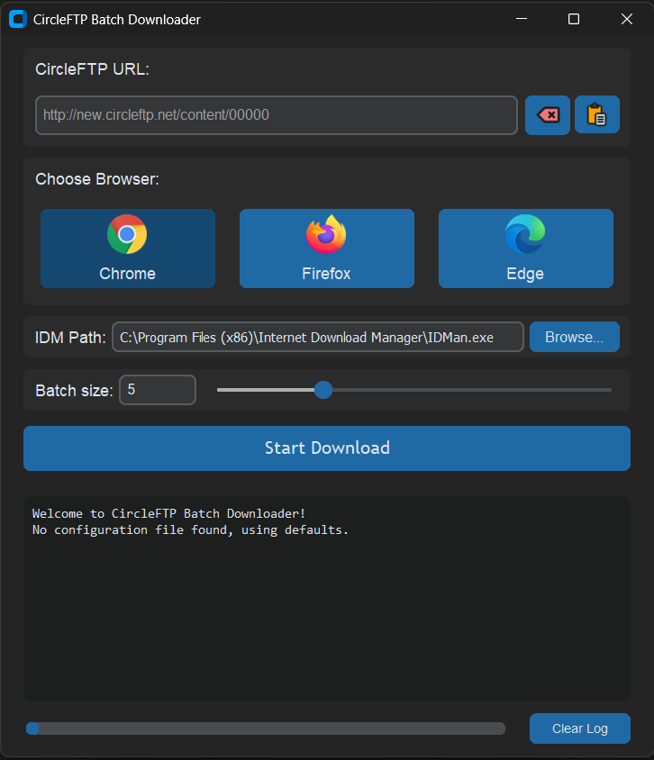
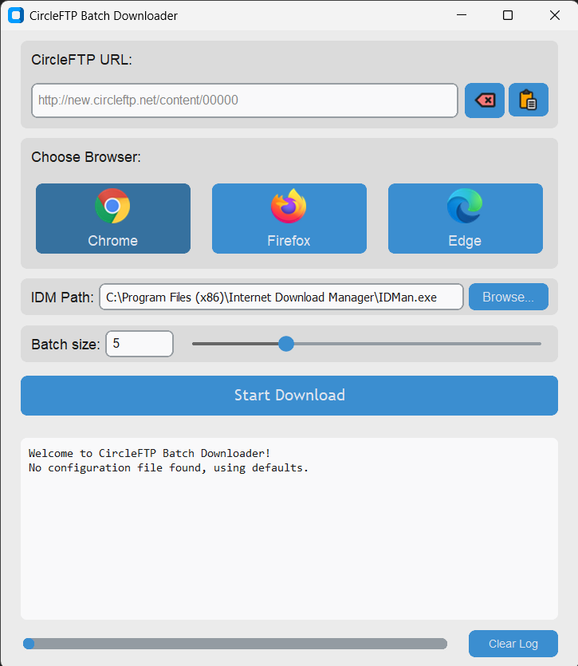

# CircleFTP Batch Downloader

A simple desktop application to help download multiple files in batches from CircleFTP content pages using Internet Download Manager (IDM).

## Screenshot

<table style="margin-left: auto; margin-right: auto; border: none; border-collapse: collapse;">
  <tr>
    <td align="center" style="padding: 5px 10px; border: none;">
        
    </td>
    <td align="center" style="padding: 5px 10px; border: none;">
        
    </td>
  </tr>
  <tr>
    <td align="center" style="padding-top: 5px; border: none;"><strong>Dark Mode</strong></td>
    <td align="center" style="padding-top: 5px; border: none;"><strong>Light Mode</strong></td>
  </tr>
</table>

---
## Overview

The CircleFTP Batch Downloader streamlines the process of sending multiple download links from a single CircleFTP (or similar) content page to IDM. Instead of manually adding each link, this tool fetches all download links from the page and sends them to IDM in manageable batches, according to your preference.

This tool is particularly useful for users in Bangladesh who frequently download content from FTP servers like CircleFTP.

## Features

* **Link Extraction:** Automatically fetches all download links from a given CircleFTP content page URL or a locally saved HTML file.
* **Batch Sending to IDM:** Sends the extracted links to your installed Internet Download Manager (IDM) in batches.
* **Configurable Batch Size:** You can choose how many links are sent to IDM at a time using a slider and a text input.
* **Start, Continue, Abort:**
    * Start the initial download process.
    * "Continue" button to send the next batch of links.
    * "Abort" button to stop the entire batch download process at any point.
* **Configurable IDM Path:** Set the path to your `IDMan.exe` if it's not in the default location. This setting is saved.
* **Settings Persistence:** Remembers your last used URL, IDM path, preferred browser, and batch size.
* **Browser Choice:** Supports using Chrome, Firefox, or Edge (via Selenium) for fetching links from live web pages.
* **User-Friendly Interface:** Simple GUI with progress bar and activity log.
* **Clear URL & Paste:** Convenience buttons for managing the URL input.

## Prerequisites

* **Operating System:** Windows (tested on Windows 10/11).
* **Internet Download Manager (IDM):** Must be installed on your PC.
* **Web Browsers (Optional but Recommended):** If you plan to fetch links from live URLs, having Google Chrome, Mozilla Firefox, or Microsoft Edge installed is recommended. The necessary WebDrivers are included with the application for these browsers.

## How to Download & Run

1.  Go to the **[Releases Page](https://github.com/zaheen4/circleftp-batch-downloader/releases)** of this repository.
2.  Download the latest `CircleFTPDownloader.exe` file from the "Assets" section.
3.  Save the `.exe` file to any folder on your computer.
4.  Double-click `CircleFTPDownloader.exe` to run the application. No installation is needed.

## How to Use

1.  **First-Time Setup (IDM Path):**
    * When you first run the app, it will try to use a default IDM path.
    * If your IDM is installed in a different location, click the "Browse..." button next to "IDM Path:" to locate and select your `IDMan.exe` file (usually in `C:\Program Files (x86)\Internet Download Manager`).
    * This path will be saved for future use.

2.  **Enter Content Page URL:**
    * Paste the URL of the CircleFTP content page (the page that lists all the download links for a series or collection) into the "Content Page URL"   field.
    * You can also use the "Paste" button (clipboard icon).
    * Use the "Backspace" button to clear the URL field.

3.  **Choose Browser:**
    * Select Chrome, Firefox, or Edge. This browser will be used in the background to fetch the page content.

4.  **Set Batch Size:**
    * Use the slider or type a number into the "Batch Size" field to set how many links should be sent to IDM in each batch (e.g., 5).

5.  **Start Downloading:**
    * Click the "Start Download" button.
    * The application will fetch the HTML, extract links, and send the first batch to IDM.
    * The button will show "Working..." during this process.

6.  **Continue/Abort:**
    * If there are more links remaining after the first batch, the main button will change to "Continue", and an "Abort" button will appear next to it.
    * Click "Continue" to send the next batch of links.
    * Click "Abort" if you wish to stop the entire process and not send any more remaining links.

7.  **Log & Progress:**
    * The textbox at the bottom will show logs of the application's activity.
    * The progress bar indicates the overall progress of sending link batches to IDM.

## Configuration

The application saves your settings automatically when you close it. A configuration file named `config.json` is stored in a folder in your user directory:
* `C:\Users\YourUsername\CircleFTPDownloaderConfig\config.json` (on Windows)

This file stores:
* Your IDM executable path.
* The last URL you entered.
* Your preferred browser.
* The last batch size you set.

You can delete this file to reset to default settings if needed.

## Troubleshooting

* **Antivirus Warning:** Some antivirus programs might flag the `.exe` as suspicious (a false positive) because it's a PyInstaller bundle. You may need to add an exception for the application in your antivirus software.
* **"IDM executable not found":** Ensure the path set in the "IDM Path" field is correct and points directly to `IDMan.exe`.
* **"Download section not found":** If the website (e.g., CircleFTP) changes its HTML structure, the application might not be able to find the download links. This would require an update to the script's parsing logic.
* **WebDriver Errors:** If fetching from a live URL fails with a WebDriver error, ensure the selected browser is installed correctly and that its version is reasonably up-to-date. The included WebDrivers attempt to match common browser versions.

## Building from Source

If you want to modify or build the application from source:

1.  **Prerequisites:**
    * Python 3.9+
    * Git (optional, for cloning)

2.  **Clone the repository (optional):**
    ```bash
    git clone https://github.com/zaheen4/circleftp-batch-downloader.git
    cd circleftp-batch-downloader
    ```

3.  **Set up a Virtual Environment (recommended):**
    ```bash
    python -m venv venv
    venv\Scripts\activate  # Windows
    # source venv/bin/activate  # macOS/Linux
    ```

4.  **Install Dependencies:**
    The `requirements.txt` file should list necessary packages. You can create one using `pip freeze > requirements.txt` in your development environment. Key libraries include:
    ```
    customtkinter
    Pillow
    beautifulsoup4
    selenium
    psutil
    pyinstaller (for building)
    ```
    Install them:
    ```bash
    pip install -r requirements.txt 
    # Or: pip install customtkinter Pillow beautifulsoup4 selenium psutil pyinstaller
    ```

5.  **Run the script:**
    ```bash
    python app.py
    ```

6.  **Build the Executable (Optional):**
    Ensure `assets` and `drivers` folders are present.
    ```
    pyinstaller --name "BatchDownloader" --onefile --windowed --icon="my_icon.ico" --add-data "assets;assets" --add-data "drivers;drivers" app.py
    ```


---

Feel free to ask for feedback or report any issues!